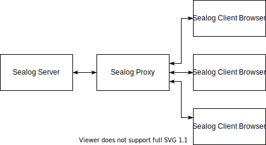

# NDSF Sealog Proxy

The Sealog Proxy broadcasts messages from a Sealog server to multiple clients.



This is useful in the case where there is limited bandwidth between the Sealog server and clients of the Sealog websockets API, such as browsers using the Sealog client web application.


## Implementation Details

Sealog uses [@hapi/nes][nes] to allow clients to subscribe to messages that the server publishes to specific paths (akin to ROS topics). The paths to which Sealog publishes can be found in [this file][sealog-ws-api]. This line declares one such subscription topic:

[nes]: https://github.com/hapijs/nes
[sealog-ws-api]: https://github.com/OceanDataTools/sealog-server/blob/master/routes/ws/events.js

```node
server.subscription('/ws/status/newCruises');
```

The proxy server tracks the subscriptions of each connected client, and forwards relevant messages to the subscribing clients. All messages originating from clients are dropped.


## Limitations

- Clients connecting the proxy are not authenticated. If Sealog content is sensitive, ensure that the proxy is not accessible to unauthorized clients.
